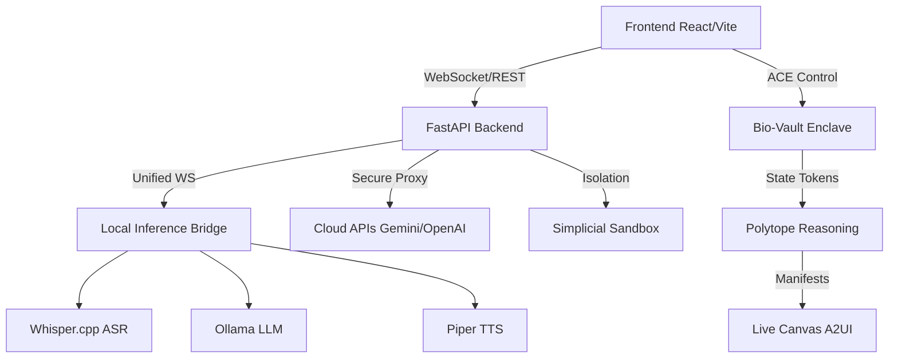

<div align="center">

</div>

# Alluci Sovereign Agent

Alluci is a professional-grade, multi-modal autonomous AI agent designed for **sovereign, local-first execution**. It features real-time voice interaction, a decentralized "Hive" architecture, and deep integration with the VerusID ecosystem for secure identity and data management.

## 🏗️ Architecture Overview

Alluci is built on the **Polytope Manifold Architecture**, prioritizing security and affective resonance:

- **Bio-Vault Isolation**: Specialized secure enclave logic in `alluciCore.ts` (`BioVault`) that isolates raw biometric telemetry, releasing only abstracted "State Tokens" to the reasoning engine.
- **Affective Computing Engine (ACE)**: A proactive flow-sensing controller (`aceController.ts`) that monitors user valence, arousal, and cognitive load to issue real-time "Flow Nudges" and interventions.
- **Sovereign Mode (Local Inference)**: A dedicated `LocalInferenceBridge` manages local processes for ASR (Whisper.cpp), LLMs (Ollama), and TTS (Piper), ensuring zero external data leakage.
- **A2UI (Live Canvas)**: An Agent-to-User visual interface (`LiveCanvas.tsx`) that allows agents to spatially project text, images, and data manifests onto a collaborative workspace.
- **Simplicial Sandboxing**: High-integrity bridge management (`bridgeManager.ts`) that enforces strict one-vault-per-bridge segregation (iMessage, Signal, Slack, etc.).

### System Diagram


## 📋 Prerequisites

- **Frontend**: Node.js ≥ 20
- **Backend**: Python ≥ 3.12
- **Local Inference Tools**:
    - [Ollama](https://ollama.com/) (for local LLMs)
    - [Whisper.cpp](https://github.com/ggerganov/whisper.cpp) (for ASR)
    - [Piper](https://github.com/rhasspy/piper) (for TTS)
- **Optional**: Homebrew (macOS) for dependency management.

## 🚀 Quick Start Guide

### 1. Setup Environment
Install local inference binaries and models:
```bash
chmod +x scripts/setup_sovereign_stack.sh
./scripts/setup_sovereign_stack.sh
```

### 2. Configuration
```bash
cp .env.example .env
```
Key variables: `POLYTOPE_MASTER_KEY` (Vault encryption), `JWT_SECRET_KEY` (Auth signing).

### 3. Execution
**Backend**:
```bash
python -m venv .venv && source .venv/bin/activate
pip install -r requirements.txt
python -m uvicorn backend.app:app --reload
```
**Frontend**:
```bash
npm install
npm run dev
```

## 🔌 API Support & Proxying

- **Zero-Exposure Policy**: All 3rd-party API calls are strictly proxied through the backend. **API keys NEVER touch the browser.**
- **Automatic Synthesis**: Support for Suno, ElevenLabs (Music/Voice), Midjourney, and Runway gen-4 via secure backend routing.

## 🧪 Testing & CI/CD

- **Backend Tests**: `python -m pytest backend/tests/`
- **Frontend Lint**: `npm run lint`
- **CI Workflows**: GitHub Actions (`ci.yml`) and Dependabot (`dependabot.yml`) ensure stability and security.

## 🔐 Security & Cryptography

- **Audit Ledger**: All actions are hashed with **WebCrypto SHA-256** and appended to a tamper-proof log.
- **No localStorage**: Session data and keys reside in `HttpOnly` cookies and the secure backend `SimplicialVault`.

## 📄 License

Alluci Sovereign Agent is released under the **MIT License**. See [LICENSE](LICENSE) for details.
