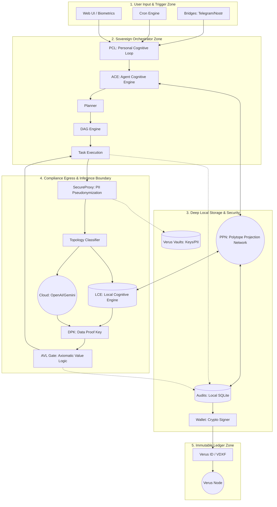

<div align="center">
  <h1>Alluci-Sovereign-Agent</h1>
  <h3>Under Development — Coming Soon</h3>
  <p><strong>The Self-Sovereign Personal/Professional AI Assistant</strong></p>
  
  <p align="center">
    
    
    
    
    
    
    
  </p>
</div>

---

<div id="mission" style="padding: 20px; border-radius: 15px; background-color: #f8fafc; border: 1px solid #e2e8f0;">
  <h2>Executive Intelligence</h2>
  <p>
    The <strong>Alluci-Sovereign Agent</strong> is a distributed, agentic runtime acting as your primary digital interface. By merging strategic hierarchical planning with a local-first execution gateway, it coordinates across a secure multi-bridge ecosystem. It is engineered for 100% data sovereignty, ensuring your personal and professional digital life remains cryptographically secured and physically under your control.
  </p>
</div>

---

## 🌌 The Polytope Manifold Architecture

Alluci abandons traditional, hallucination-prone Euclidean vector spaces in favor of **Topologically Stable Geometric Intelligence** (The Polytope Projection Network).



### 1. The Local Cognitive Engine (LCE)
- **Neural Decoupling Layer**: The `ExecutiveRouter` dynamically maps inputs to the local Gemma 4 model or 3rd-party APIs based on strict privacy checks, allowing underlying base weights to be hot-swapped without breaking your skill manifests.
- **Adaptive Bit-Width Quantization**: Maintains high-fidelity reasoning in the first dense layers while crushing MoE weights down to a 1.58-bit footprint, allowing massive 30B+ parameter models to run on consumer hardware (M1/M2/RTX 4090).
- **Draft-Verification Loop**: Utilizes native Speculative Decoding where a lightweight model (Gemma 4 E2B) drafts token sequences and the larger dense model verifies them in parallel, boosting inference speeds by 2-3x.

### 2. Executive Orchestration & DAG Planner
- **Hierarchical DAG Planner**: Complex user objectives are parsed into a Directed Acyclic Graph (DAG). Sub-tasks are executed in parallel across multiple worker agents, dramatically reducing latency for multi-step goals.
- **Dynamic Model Switching Tiers**: The Orchestrator routes tasks dynamically based on privacy constraints, speed, and intelligence needs. Local Gemma 4 handles `SENSITIVE` tasks, Groq handles high-speed tactical actions, and Gemini/Claude handle massive context analysis.
- **Token Optimization**: The `SupervisorAgent` condenses verbose worker node outputs into dense "Sovereign Context Tokens" before passing them to the next node in the DAG, preventing context-window bloat and keeping the agent comfortably within the 8K limit.

### 3. Simplicial H-LSM Memory
- **The Discrete Projection Kernel (DPK)**: Replaces slow floating-point database math with $\mathcal{O}(1)$ complexity integer-based lookups, providing sub-microsecond latency for biometric and state synchronization.
- **Topological Barcodes**: Memory isn't retrieved via keyword search. The agent generates Betti Signatures (Topological Barcodes) and retrieves context based on "Structural Homeomorphism" (logical shape), guaranteeing context relevance.

### 4. Local Fine-Tuning (SFT) & The LoRA Forge
Alluci utilizes a specialized "Training Sandbox" mode that leverages the Unsloth library (optimized for 80% less VRAM usage) to perform Supervised Fine-Tuning (SFT) directly on your hardware.
- **The Data Pipeline**: Alluci’s H-LSM Memory acts as the dataset generator. It continuously scrapes and cleans your local usage logs, business documents, and chat history into a secure "Sovereign Dataset."
- **Native DPO & LoRA Forge**: You can trigger a "Skill Distillation" session where Alluci uses your specific data and a native PyTorch Direct Preference Optimization (DPO) kernel to forge custom LoRA (Low-Rank Adaptation) adapters for Gemma 4.

### 5. The "Dream" Cycle & Autonomous Evolution
When the system detects low cognitive load (you are asleep or away), the daemon halts external polling and reallocates 100% of hardware resources to internal evolution:
- **Cognitive Distillation**: Analyzes the day's interactions using Socratic questioning, distilling episodic logs into permanent Semantic Truths.
- **Teacher-Student Harvest**: Records high-quality reasoning from interactions with 3rd-party cloud models and queues them as "Chosen" preference pairs for the local DPO forge—crystallizing cloud intelligence into your local machine overnight.

---

## 🧬 Affective Computing Engine (ACE)

The ACE aligns machine logic with human biology. It bridges raw data and human sentiment, ensuring the assistant works in resonance with your current physiological and mental state.

### Multi-Modal Polytope Fusion
- **Zero-Latency Biometrics**: Streams Heart Rate, HRV, and Respiratory Rate directly from your Apple Watch into a shared "Affective Polytope". The agent intrinsically "feels" your physical stress without relying on string-to-vector language conversions.
- **Resonance Mapping**: ACE adjusts agent autonomy and notification intensity in real-time. If physical strain is high, the Assistant deprioritizes non-urgent tasks.
- **Ambient ACE Dashboard**: An SVG-based dynamic visualizer in the Terminal header. A pulsating Polytope shifts color (Valence), animation speed (Arousal), and structural complexity (Tension) in real-time to mirror your physical state.

---

## 🛡️ Hardware-Level Security & Verus Identity

- **The Sovereign Kill Switch**: If the agent attempts a high-cognitive action (banking, database writes, crypto tx) and your Apple Watch is off-wrist or no pulse is detected, the execution is instantly aborted and memory is encrypted.
- **Wallet & Verus Node Integration**: Full integration with the Verus blockchain. Operates a local Verus node to secure your identity (VerusID), manage sovereign funds, and sign transactions cryptographically within the vault.
- **Federated Pheromone Sync**: The `AntNetworkProtocol` allows you to share problem-solving paths with other agents on the Verus network by broadcasting abstract "Topological Barcodes" (Pheromones)—achieving swarm intelligence without ever sharing raw text or private data.
- **Multi-Modal Anti-Spoofing**: Defeats AI deepfakes. Cross-references audio micro-hesitations (jitter/breath pauses) from `Whisper.cpp` against your actual, live respiratory sync from the Apple Watch to ensure human liveness.
- **Simplicial Vaults**: Every external bridge (Signal, iMessage, Slack, G-Drive) operates in its own isolated cryptographic container tied to your **VerusID**.

---

## 🚀 Quick Start & Local Setup Guide

The new **Sovereignty Level Wizard** makes onboarding seamless. Choose between Cloud-only (Level 1), Local Edge (Level 2), or the Full Sovereign Base (Level 3).

### 1. Prerequisites
- **Frontend**: [Node.js](https://nodejs.org/) (v20+)
- **Backend**: [Python](https://www.python.org/) (v3.12+)
- **Local Inference Tools** (Optional based on Sovereignty Level):
    - [Ollama](https://ollama.com/) (Hosts the Gemma 4 model family for active inference)
    - [Whisper.cpp](https://github.com/ggerganov/whisper.cpp) (ASR)
    - [Piper](https://github.com/rhasspy/piper) (TTS)

### 2. Automated Stack Setup
Run the setup script to install local binaries and pull the required models:
```bash
chmod +x scripts/setup_sovereign_stack.sh
./scripts/setup_sovereign_stack.sh
```

### 3. Environment Configuration
Clone the repository and initialize the environment:
```bash
cp .env.example .env
```
Fill in your `POLYTOPE_MASTER_KEY` (used for Vault 2FA and encryption) and `JWT_SECRET_KEY`.

### 4. Backend Execution
```bash
python -m venv .venv
source .venv/bin/activate  # On Windows: .venv\Scripts\activate
pip install -r requirements.txt
python -m uvicorn backend.app:app --reload
```

### 5. Frontend Execution
```bash
npm install
npm run dev
```
Open `http://localhost:5173` to access the Alluci Sovereign Gateway. Upon first launch, the **Sovereignty Wizard** will guide you through your stack configuration.

---

## The Sovereign Manifold

Alluci empowers you to act across your entire digital life from a single, secure interface:
- **Social_Manifold**: Targeted actualization across WhatsApp, Telegram, Discord, Signal, X, and Meta.
- **Enterprise_Core**: Deep professional workflow integration with Slack, MS Teams, and the full G-Suite.
- **Cloud_Manifold**: Sovereign file management and E2EE pulse dispatching via iCloud and iMessage secure tunnels.

---

## Multi-Modal Synthesis & API Orchestration

Alluci coordinates across a secure multi-bridge ecosystem, providing unified access to state-of-the-art tools:

#### 1. LLM_REASONING_&_LOGIC
- **OpenAI**: GPT for deep strategic planning.
- **Anthropic**: Claude for nuanced context and coding.
- **Google Cloud**: Gemini for massive context and speed.
- **Groq**: LPU-powered high-speed tactical execution.

#### 2. CONVERSATIONAL_AUDIO
- **OpenAI Realtime API**: emotionally resonant vocal interaction.
- **ElevenLabs**: Specialized Agents API for high-fidelity voice synthesis.
- **Retell AI**: Professional telephony and automated dialogue.

#### 3. MULTI-MODAL CREATIVITY
- **Music**: Udio, Soundraw, and AIVA for melodic composition.
- **Image**: NanoBanana, Midjourney, DALL·E 3, & Fal.ai.
- **Video**: Google Veo, Runway, & Luma Dream Machine for temporal genesis.

---

## 🛠️ Production Readiness Suite

Alluci Sovereign Agent includes a rigorous production readiness suite to ensure stability, security, and supply-chain integrity.

To run the full quality gate locally:
```bash
make quality
```

This script executes:
- **Preflight**: Validates toolchain and registry reachability.
- **Quality**: Runs full frontend and backend test suites, linting, and type checking.
- **Security**: Performs `npm audit`, `pip-audit`, and `detect-secrets` scanning.
- **Deploy**: Validates deployment manifests for immutable image digests.
- **Reporting**: Generates a timestamped markdown report in `reports/`.

---

## 📜 License

**Copyright © 2026 Alluci-Ai. All Rights Reserved.**

This software and associated documentation files (the "Software") are the proprietary property of Alluci-Ai. 
Unauthorized copying, reproduction, distribution, modification, or use of this Software, via any medium, is strictly prohibited without the express written permission of Alluci-Ai.

---
<p align="center"><em>"Alluci-Polytope: Turning AI from a passive tool into a sovereign, affective partner."</em></p>
## 🔧 Debug Mode

The `DEBUG` environment variable (default `False`) controls error verbosity.

- **Production (`DEBUG=False`)** – JSON‑RPC errors omit the `data` field and FastAPI exception details are masked.
- **Development (`DEBUG=True`)** – Detailed validation errors are included in the `data` field and full exception messages are returned.

Set `DEBUG=True` in your `.env` or export the variable locally to enable detailed diagnostics during development.
