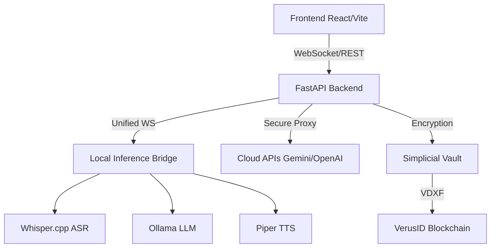

<div align="center">

</div>

# Alluci Sovereign Agent

Alluci is a professional-grade, multi-modal autonomous AI agent designed for **sovereign, local-first execution**. It features real-time voice interaction, a decentralized "Hive" architecture, and deep integration with the VerusID ecosystem for secure identity and data management.

## 🏗️ Architecture Overview

Alluci is built on a modular **Manifold Architecture** that prioritizes security, privacy, and autonomy:

- **Sovereign Mode (Local Inference)**: Utilizes a dedicated `LocalInferenceBridge` to manage singleton processes for ASR (Whisper.cpp), LLMs (Ollama), and TTS (Piper). This ensures zero external data leakage.
- **Hive Orchestration**: A DAG-based execution engine (`Planner` → `Executor` → `Critic`) that handles complex objectives across various tool silos.
- **Simplicial Vault**: A zero-trust security layer that encrypts and stores API keys server-side, anchored by VDXF (Verus Data Exchange Format) for on-chain integrity.
- **Polytope Framework**: A novel reasoning layer with manifold integrity checks to prevent state drift and ensure logical coherence.
- **Affective Engine**: Real-time biometric and emotional telemetry analysis for high-bandwidth human-agent resonance.

### System Diagram


## 📋 Prerequisites

- **Frontend**: Node.js ≥ 20
- **Backend**: Python ≥ 3.12
- **Local Inference Tools**:
    - [Ollama](https://ollama.com/) (for local LLMs)
    - [Whisper.cpp](https://github.com/ggerganov/whisper.cpp) (for ASR)
    - [Piper](https://github.com/rhasspy/piper) (for TTS)
- **Optional**: Homebrew (macOS) for automated dependency management.

## 🚀 Quick Start Guide

### 1. Setup Environment
Run the automated setup script to install local inference binaries and models:
```bash
chmod +x scripts/setup_sovereign_stack.sh
./scripts/setup_sovereign_stack.sh
```

### 2. Configuration
Copy the environment template and fill in your master keys:
```bash
cp .env.example .env
```
Key variables: `POLYTOPE_MASTER_KEY` (Vault encryption), `JWT_SECRET_KEY` (Auth signing).

### 3. Execution
**Backend**:
```bash
# Recommended: Create a virtual environment
python -m venv .venv && source .venv/bin/activate
pip install -r requirements.txt
python -m uvicorn backend.app:app --reload
```
**Frontend**:
```bash
npm install
npm run dev
```

## 🔌 API Support & Proxying

- **Sovereign Support**: Built-in support for local Llama 3, Mistral, and Phi-3 via Ollama.
- **Cloud Failover**: Unified routing across Gemini, OpenAI, Anthropic, Groq, and DeepSeek.
- **Zero-Exposure Policy**: All 3rd-party API calls are strictly proxied through the backend. **API keys never touch the browser.**

## 🧪 Testing & CI/CD

Alluci uses `pytest` for backend verification and GitHub Actions for continuous integration.

- **Run Standard Tests**: `python -m pytest backend/tests/`
- **With Coverage**: `python -m pytest --cov=backend backend/tests/`
- **CI Workflows**: Integrated `.github/workflows/ci.yml` runs linting and tests on every push.

## 🔐 Security & Cryptography

- **Audit Ledger**: All critical agent actions are hashed using **WebCrypto SHA-256** and appended to a tamper-proof log.
- **No localStorage**: Sensitive session data and API keys are stored in `HttpOnly` cookies and the secure backend vault.
- **Heartbeat Integrity**: The `HeartbeatDaemon` performs periodic SHA-256 file integrity checks on its own core logic.
- **VerusID Auth**: Multi-signature authentication and VDXF-anchored data storage (optional).

## 📄 License

Alluci Sovereign Agent is released under the **MIT License**. See [LICENSE](LICENSE) for details.

---
Contributions are welcome! Please review [`CONTRIBUTING.md`](CONTRIBUTING.md) before submitting Pull Requests.
